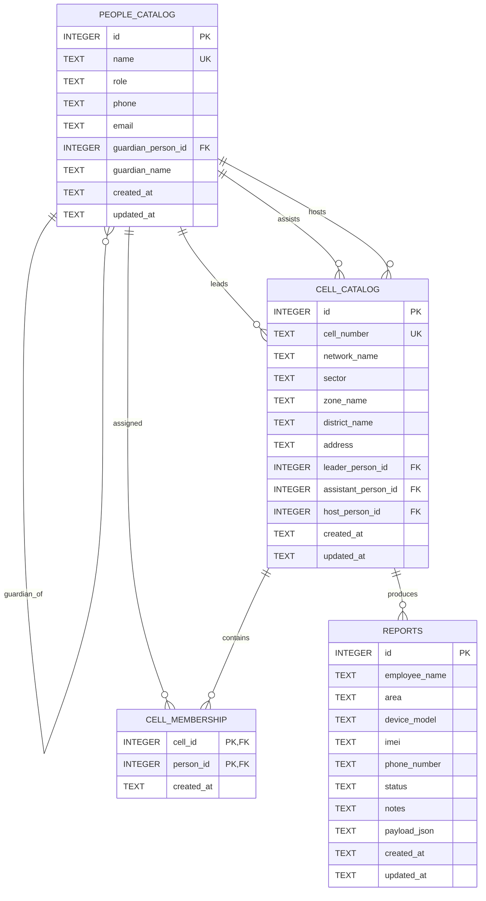

# Modelo de Base de Datos

## Vista General

El modelo actual se divide en dos partes:

1. Estructura relacional fija para catálogos y relaciones base.
2. Snapshot semanal dentro de `reports.payload_json` para la captura operativa.

## Diagrama Entidad-Relación



## Tablas

### `people_catalog`

Catálogo maestro de personas.

Roles válidos:

- `leader`
- `assistant`
- `host`
- `member`
- `kid`
- `all`

Campos:

- `id`: identificador interno.
- `name`: nombre único.
- `role`: perfil operativo.
- `phone`: teléfono.
- `email`: correo.
- `guardian_person_id`: responsable relacionado cuando el niño depende de una persona ya registrada.
- `guardian_name`: texto libre para responsable no catalogado.
- `created_at`: fecha de creación.
- `updated_at`: fecha de actualización.

### `cell_catalog`

Catálogo maestro de células.

Campos:

- `id`: identificador interno.
- `cell_number`: número único de célula.
- `network_name`: red.
- `sector`: sector.
- `zone_name`: zona.
- `district_name`: distrito.
- `address`: domicilio.
- `leader_person_id`: líder asignado.
- `assistant_person_id`: asistente asignado.
- `host_person_id`: anfitrión asignado.
- `created_at`: fecha de creación.
- `updated_at`: fecha de actualización.

### `cell_membership`

Tabla puente entre personas y células.

Campos:

- `cell_id`: referencia a la célula.
- `person_id`: referencia a la persona.
- `created_at`: fecha de asignación.

Uso:

- Relaciona miembros con la célula.
- También permite precargar niños de la célula en el reporte semanal.

### `reports`

Tabla de reportes semanales.

Campos físicos actuales:

- `id`: identificador del reporte.
- `employee_name`: usado hoy para `leaderName`.
- `area`: usado hoy para `assistantName`.
- `device_model`: usado hoy para `cellNumber`.
- `imei`: usado hoy para `reportDate`.
- `phone_number`: usado hoy para `week`.
- `status`: usado hoy para `sector`.
- `notes`: notas generales.
- `payload_json`: snapshot completo del formulario.
- `created_at`: fecha de creación.
- `updated_at`: fecha de actualización.

## Snapshot Semanal en `payload_json`

Aunque el catálogo vive en tablas, el detalle semanal del reporte vive embebido en JSON.

Estructura principal:

```json
{
  "week": "1",
  "cellNumber": "6",
  "leaderName": "Fabian Macias",
  "assistantName": "Blanca Vargas",
  "reportDate": "2026-05-04",
  "memberAttendance": [],
  "visitors": [],
  "kids": [],
  "attendanceSummary": {}
}
```

### `memberAttendance[]`

Campos típicos por fila:

- `personId`
- `name`
- `role`
- `status`
- `planningAttended`
- `reachAttended`
- `reachPrivileged`
- `sundayAttended`
- `note`

### `visitors[]`

Campos típicos por fila:

- `name`
- `invitedBy`
- `reachAttended`
- `sundayAttended`
- `firstVisit`
- `converted`
- `phone`
- `note`

### `kids[]`

Campos típicos por fila:

- `personId`
- `name`
- `guardianName`
- `source`
- `reachAttended`
- `sundayAttended`
- `note`

`source` puede ser:

- `catalog`: niño precargado desde la célula.
- `visit`: niño agregado manualmente para esa semana.

### `attendanceSummary`

Métricas derivadas del reporte:

- `planningMembersPresent`
- `planningMembersAbsent`
- `reachMembersPresent`
- `reachPrivilegedMembers`
- `reachFriendsPresent`
- `reachConversions`
- `reachKidsPresent`
- `multiplySundayAttendance`
- `present`
- `absent`
- `justified`
- `service`
- `pending`

## SQL de Referencia

```sql
CREATE TABLE IF NOT EXISTS people_catalog (
    id INTEGER PRIMARY KEY AUTOINCREMENT,
    name TEXT NOT NULL UNIQUE,
    role TEXT NOT NULL,
    phone TEXT NOT NULL DEFAULT '',
    email TEXT NOT NULL DEFAULT '',
    guardian_person_id INTEGER,
    guardian_name TEXT NOT NULL DEFAULT '',
    created_at TEXT NOT NULL,
    updated_at TEXT NOT NULL
);

CREATE TABLE IF NOT EXISTS cell_catalog (
    id INTEGER PRIMARY KEY AUTOINCREMENT,
    cell_number TEXT NOT NULL UNIQUE,
    network_name TEXT NOT NULL DEFAULT '',
    sector TEXT NOT NULL,
    zone_name TEXT NOT NULL DEFAULT '',
    district_name TEXT NOT NULL DEFAULT '',
    address TEXT NOT NULL DEFAULT '',
    leader_person_id INTEGER,
    assistant_person_id INTEGER,
    host_person_id INTEGER,
    created_at TEXT NOT NULL,
    updated_at TEXT NOT NULL
);

CREATE TABLE IF NOT EXISTS cell_membership (
    cell_id INTEGER NOT NULL,
    person_id INTEGER NOT NULL,
    created_at TEXT NOT NULL,
    PRIMARY KEY (cell_id, person_id)
);

CREATE TABLE IF NOT EXISTS reports (
    id INTEGER PRIMARY KEY AUTOINCREMENT,
    employee_name TEXT NOT NULL,
    area TEXT NOT NULL,
    device_model TEXT NOT NULL,
    imei TEXT NOT NULL,
    phone_number TEXT NOT NULL DEFAULT '',
    status TEXT NOT NULL DEFAULT 'activo',
    notes TEXT NOT NULL DEFAULT '',
    payload_json TEXT NOT NULL DEFAULT '{}',
    created_at TEXT NOT NULL,
    updated_at TEXT NOT NULL
);
```

## Observaciones de Diseño

- El modelo relacional actual está orientado a catálogos y captura rápida.
- El historial semanal detallado todavía no está normalizado en tablas hijas.
- `reports.payload_json` funciona como snapshot completo del estado semanal.
- Si más adelante se necesita analítica más fuerte, se puede normalizar en tablas como:
  - `report_member_attendance`
  - `report_visitors`
  - `report_kids`
```